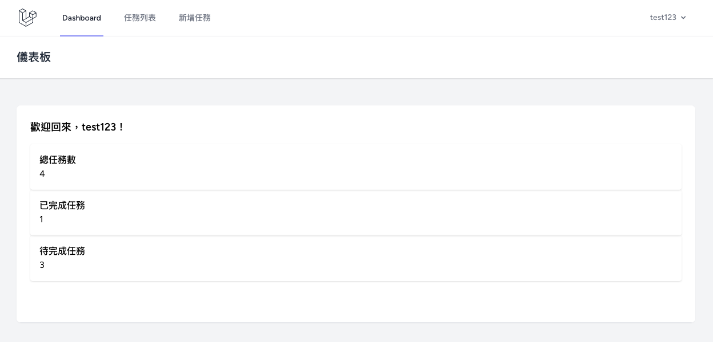
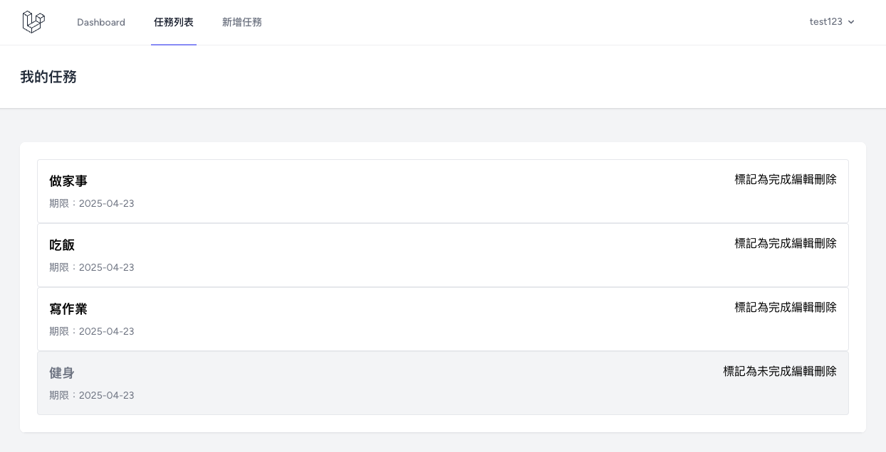
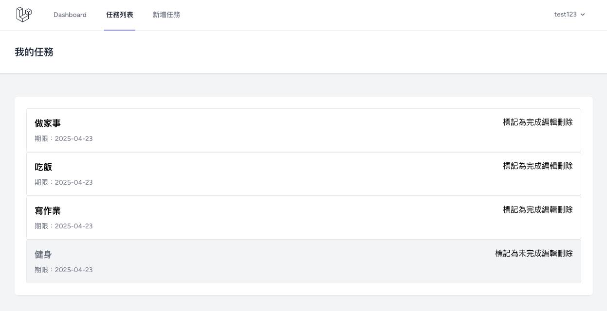

# Laravel Sail 任務管理器開發指南

本專案是一個簡易任務管理器，使用 Laravel 9 和 Laravel Sail 建構，具備完整的使用者認證與任務 CRUD 功能。

## ✨ 專案特色
- 使用 Laravel Sail 架設 Docker 開發環境
- 任務管理：建立、編輯、完成、刪除
- 使用者認證與授權策略
- 清晰的資料庫與前後端架構

## 🔧 開發環境設置
```bash
curl -s "https://laravel.build/task-manager" | bash
cd task-manager
./vendor/bin/sail up -d
```

## 🗄️ 資料庫與模型
- 建立 `tasks` 資料表並設置與使用者關聯
- 使用 Eloquent 定義 Task 與 User 模型的關係

## 🔐 認證系統（Laravel Breeze）
```bash
./vendor/bin/sail composer require laravel/breeze --dev
./vendor/bin/sail artisan breeze:install blade
./vendor/bin/sail artisan migrate
```

## 🧠 控制器與授權
- 使用 `TaskController` 處理任務 CRUD
- 利用 `TaskPolicy` 確保使用者只能操作自己的任務

## 🌐 路由設計
```php
Route::middleware('auth')->group(function () {
    Route::resource('tasks', TaskController::class);
    Route::patch('/tasks/{task}/toggle-complete', [TaskController::class, 'toggleComplete'])->name('tasks.toggle-complete');
});
```

## 🖼️ 前端視圖
- 使用 Blade 設計任務列表、詳情、表單頁面
- Tailwind CSS 提供現代化介面

## 📁 專案結構（精簡版）
```
task-manager/
├── app/Http/Controllers/TaskController.php
├── app/Models/Task.php
├── database/migrations/..._create_tasks_table.php
├── resources/views/tasks/*.blade.php
├── routes/web.php
└── docker-compose.yml
```

## 🚀 運行與測試
```bash
./vendor/bin/sail artisan migrate
./vendor/bin/sail up -d
```
- 瀏覽器開啟 http://localhost 註冊帳號即可使用

## ✅ 安全與最佳實踐
- 所有操作需登入與授權
- 使用 CSRF、資料驗證、防止非法存取
- 建議生產環境禁用除錯，並設定 `.env`

## 🌱 擴展功能建議
- 任務分類、標籤、優先級、截止通知、團隊協作

## 🧩 常見問題排解
- `.env` 設定錯誤 → 檢查資料庫連線
- 權限問題 → `chmod -R 775 storage bootstrap/cache`
- 清除快取 → `./vendor/bin/sail artisan optimize:clear`
- 檢查路由 → `./vendor/bin/sail artisan route:list`
## ❤️‍🔥 Demo展示
- **Dashboard**

- **任務列表**

- **新增任務**


